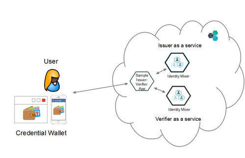

# Identity Mixer Issuer-Verifier Overview

This sample application demonstrates how the IBM Identity Mixer issuance and verification services can enable privacy-preserving authentication for your customers.

More information and demonstration of the Identity Mixer technology is available [here](https://idemixdemo.mybluemix.net).

This sample code is released under the Apache 2.0 license (see License.txt) in the root folder. Please refer to the package.json for the dependencies. 

A running implementation of the sample application is already available at https://idemix-issuer-verifier.mybluemix.net/ for testing and demonstration.

You can also run the issuer and verifier as 2 separate applications. 
Please note that the anonymity and unlinkability properties are preserved even if the issuance and verification services are provided within one application.

## Application Requirements

Currently the Identity Mixer Service is running as experimental and works with Node.js™ applications.      

This constraint is mainly due to the [credential wallet sample application](https://idmx-wallet.mybluemix.net/) that is used together with the service.     

A credential wallet account is required to use both issuance and verification services.       

While the service is experimental we ask users to NOT store any personal data in the sample credential wallet.      

Since the core service offers REST API, other runtimes will be also supported when migrating to Beta and GA. 
The credential wallet will be released as a mobile application in the beginning of 2016.

## How it Works

1. Create an account with the [credential wallet sample application](https://idmx-wallet.mybluemix.net/).
1. Go to the [app URL](https://idemix-issuer-verifier.mybluemix.net/).  

### Issuance             
1. Press "Get Subscription", choose the validity period.          
1. After acknowledging the Privacy Policy press the Issue button.  
1. After a credential wallet pop-up window appears, login into your credential wallet account (if you are not logged in already) and press the "Allow" button.      
1. After the issuance is completed you can log in into your credential wallet account and check if the subscription voucher was issued.

### Verification       
1. Choose "Check Access" from the menu.       
1. Choose the presentation policy and press the "Check your access" button.
1. After a credential wallet pop-up window appears, login into your credential wallet account (if you are not logged in already) and press the "Allow" button.      
1. After authentication is completed the pop-up will close and you will see the success/failure message.

## Architecture Diagram

This an architectural overview of the systems that make this app run.



## Running the Issuer-Verifier app on Bluemix

Ensure that you have an IBM Bluemix account and the capability to deploy applications to the IBM Bluemix environment. 
[Sign up](https://console.ng.bluemix.net/registration/) for Bluemix, or use an existing account.

We discribe here 2 options for forking, configuring and deploying this application to Bluemix: 

1. Automatic deployment with the Bluemix DevOps pipeline: simple, requires only a web browser to deploy and edit the code. 
It consists of the following steps, described in detail below:
  1. Login to Bluemix and create two instances of the Identity Mixer experimental service.      
  2. Press Deploy to Bluemix button to automatically fork and deploy the app to Bluemix.         
  3. [Optional] Configure the service.       
  4. [Optional] Edit the code to adapt the app to the service.

1. Manual deployment: checking out a local copy of the code and pushing it to Bluemix.
It consists of the following steps, described in detail below:        
  1. Install cloud-cli tool.
  1. Clone this repository and adjust the configuration files.
  1. Login to Bluemix and create two instances of the Identity Mixer experimental service.          
  3. Configure the service and edit the code to adapt the app to the service.
  4. Push the code to Bluemix.

## Automatic Deployment to Bluemix

### Create two instances of the IBM Identity Mixer experimental service - one for issuance and one for verification:
1. Login to IBM Bluemix.
1. Click "Use Services or APIs".
1. Go to the Bluemix Labs catalog (you have to scroll down to the bottom of the Bluemix catalog).
1. Click "IBM Identity Mixer" from within the "Security" section of the Bluemix Labs catalog:      

1. Configure the Identity Mixer service in the "Add Service" section of the page:    

  1. Leave the service unbound.
  1. Type in the name "IBM Identity Mixer-issuer" for one instance service and "IBM Identity Mixer-verifier" for the second one.
  1. Currently the service is provided for free, so there is no plan to select.
  1. Having ensured the TERMS were acceptable to you, click CREATE.

1. Press this button to start the deployment: [](https://bluemix.net/deploy)

As you can see, the application is running now with the sample keys and a sample credential specification since the Identity Mixer service instances are not configured yet. 
However, you can now configure the services to generate a new set of the issuance keys, define your own credential specification(s) and access control policies by following the instructions below. 

### Issuer service configuration:

1. From the IBM Bluemix Dashboard, locate and click your newly created Bluemix Node.js™ application to which you bound the Identity Mixer services.
1. Within the Services section of the your application, click its Identity Mixer-issuer service. The Identity Mixer Setup Console will be loaded: 

1. Choose the ISSUER role and press START SETUP.
1. Choose a unique name for the Issuer (it must be unique within Bluemix, not only your organization since it will be visible to the other applications that use Identity Mixer service):       

1. Add *Credential specification(s)* (a list of the attributes that are contained in a credential) that will be issued by your application by selecting one of the options below:
  1. Select one of the existing specifications that are non-editable:          
          

  1. OR Craft your own credential specification:         

      * Choose a unique name of the Credential Specification.
      * Specify a link to the image that will be an icon displayed in the user's credential wallet. You can also use the default image.
      * Add Attributes to you specification by clicking ADD ATTRIBUTE, choosing a Human Readable Name and the appropriate Data Type for each attribute.
1. When you are done, press NEXT.
1. After the Issuer keys are generated (this might take up to 2-3 min because of the key length, but this is only done once) a JSON file with all configuration information will be displayed:          
         
PLEASE NOTE: This service is only available as experimental to demonstrate the technology. Please DO NOT use any real (personal) data with our service. 
All credential specifications and issuer parameters (only the public key) are visible to the other applications that use Identity Mixer Experimental Service.
1. After Setup is completed, you can always see this JSON file when selecting the service instance from the dashboard. The details on how to use this JSON file are described below in the Decomposition Instructions section.

### Verifier service configuration:

1. From the IBM Bluemix Dashboard, locate and click your newly created Bluemix Node.js™ application to which you bound the Identity Mixer services.
1. Within the Services section of the your application, click its Identity Mixer-verifier service. The Identity Mixer Setup Console will be loaded: 

1. Choose the VERIFIER role and press START SETUP.
3. Define *access control policies* (description of what a user has to prove/reveal in order to be granted access to a resource). You can choose more than one policy using any of the options below: 
 1. Select one of the existing policies that are non-editable:          
          

  1. OR Craft your own policy by choosing CREATE NEW POLICY:         

      * Specify a unique human-readable name of the policy (it must be unique within Bluemix, not only your organization since it will be visible to the other applications that use Identity Mixer service).
      * Define predicates by clicking ADD PREDICATE, choosing the credential issuer, credential type, attribute, operator, and defining a constant:        

1. When you are done, press NEXT.
1. After the presentation policies are generated a JSON file with the information about the policies will be displayed:          
       
PLEASE NOTE: This service is only available as experimental to demonstrate the technology. Please DO NOT use any real personal data with our service. 
All presentation policies are visible to the other applications that use Identity Mixer Experimental Service.
1. After Setup is completed, you can always see this JSON file when selecting the service instance from the dashboard. The details on how to use this JSON file are described below in the Decomposition Instructions section.

## Decomposition Instructions

1. Click EDIT CODE button that appears after the auto deployment is completed and you will see the source files of your project that was forked from this project.
1. Edit the configuration files:
  1. Copy the content of the issuer JSON file into "public/js/issue_config.js" file. Save the issue_config.js file by selecting File>Save from the menu.
  1. If you created your own specification, also in the file "public/js/issue_helper.js" on line 33, form the payload with the proper attribute values. Note that the order of the values needs to be the same as in the configuration JSON.
  1. Copy the content of the verifier JSON file into "public/js/presentation_config.js" file. Save the presentation_config.js file by selecting File>Save from the menu.
  You can also use the policy UID from the configuration JSON file directly to call the service endpoints as it is done in "public/js/presentation_config.js".
1. Push your changes:
  1. Go to the Git Repository by clicking the 'branch' icon (Git Repository) directly under the editing-pencil on the left of the page.
  1. In the Changed Files section, select the check boxes to the left of the files you just edited to indicate that you want to commit the changes you made.
  1. Provide an appropriate Commit message and click COMMIT FILES.
  1. On the OUTGOING section under the Commits for the "master" branch, click PUSH to push your changes to the Remote branch.
1. Build and Deploy: since the deployment pipeline is already created, the deployment will start automatically after the PUSH is performed.
Click BUILD & DEPLOY to verify the deployment status, and to locate the link to your application.
      
## Manual deployment to Bluemix

2. Download and install the [Cloud-foundry CLI](https://github.com/cloudfoundry/cli) tool

3. Clone the app to your local environment from your terminal using the following command

  ```
  git clone https://hub.jazz.net/git/idemix/issuer-verifier
  ```

4. cd into this newly created directory

5. Edit the `manifest.yml` file and change the `<application-name>` and `<application-host>` to something unique.

  ```     
  applications:
     - disk_quota: 1024M
  host: <application-host>      
  name: <application-name>
  path: .
  command: node app.js
  domain: mybluemix.net
  instances: 1
  memory: 256M
  services:
  - <service-name>
  - <service-name>       
  ```
  The host you use will determinate your application url initially, e.g. `<application-host>.mybluemix.net`.

7. Login to Bluemix web UI.      

8. Create and configure the services as described in the instructions above.      

9. Edit the code as described above.      

6. Connect to Bluemix with the command line tool and follow the prompts to login.

  ```
  $ cf api https://api.ng.bluemix.net
  $ cf login
  ```
   
10. Push your application to Bluemix from the root application folder. 

  ```
  $ cf push -f ./manifest.yml
  ```

## API documentation

You can also refer to the [getting started](https://www.ng.bluemix.net/docs/services/identitymixer/index.html) and [Swagger API](http://idmx-service-media.mybluemix.net/docs/) documentation. 

## Troubleshooting

The primary source of debugging information for your Bluemix app is the logs. To see them, run the following command using the Cloud Foundry CLI:

  ```
  $ cf logs <application-name> --recent
  ```
For more detailed information on troubleshooting your application, see the [Troubleshooting section](https://www.ng.bluemix.net/docs/troubleshoot/tr.html) in the Bluemix documentation.

You can also contact us directly by email idemix@zurich.ibm.com. We will be happy to help.
